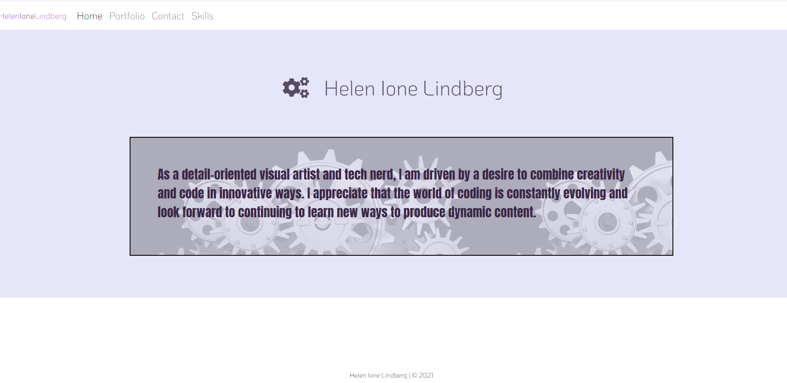
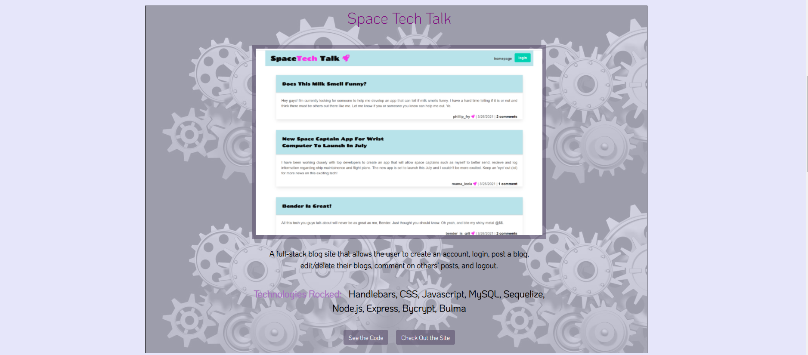
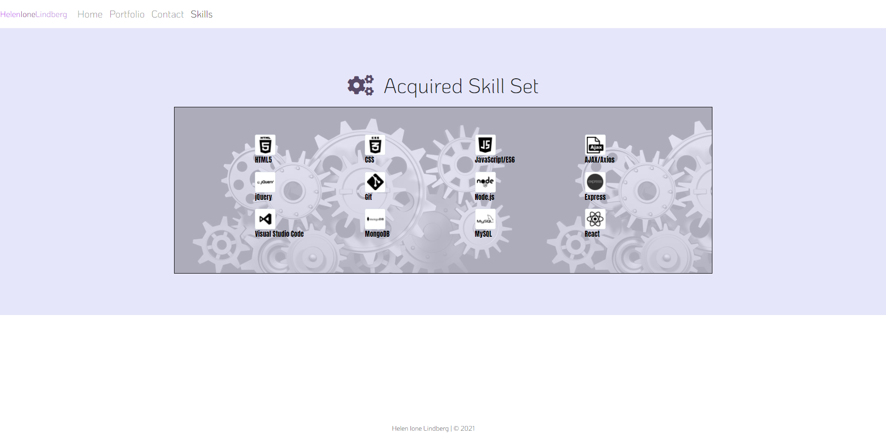
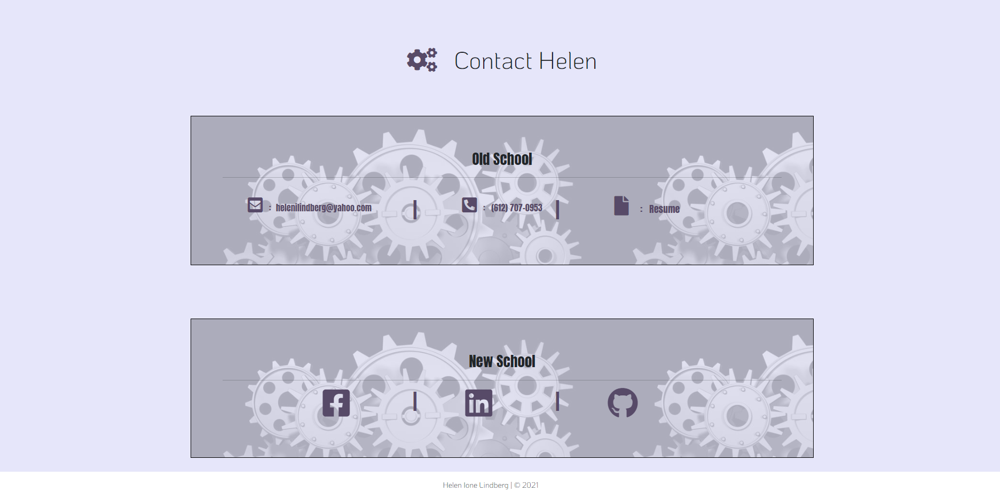

# Helen Ione Lindberg
```
"A React-based mobile-friendly Portfolio page utilizing HTML, CSS, Bootstrap, and JavaScript. 
Featuring Home, Portfolio, Contact, and Skills pages with links to social
and professional accounts."
```
---
<br>

<br><br>

<br><br>

---

## Technologies Used

* React
* React-Router-DOM
* JavaScript
* HTML
* CSS
* Bootstrap
<br>
---
<br>

<br><br>


---

## Deployment

View the GitHub page <a href="https://helenil.github.io/React-Porfolio/">HERE</a>

<h2>OR</h2>

Clone the <a href="https://github.com/HelenIL/React-Porfolio">REPOSITORY</a> and run command 
"npm install" followed by "npm start"
to view the application locally.
---

## Contact

Helen I. Lindberg<br>
Email: helenilindberg@yahoo.com<br>
Github Profile: <a href="https://github.com/HelenIL">https://github.com/HelenIL</a> 
<br><br>
[](https://opensource.org/licenses/MIT)
